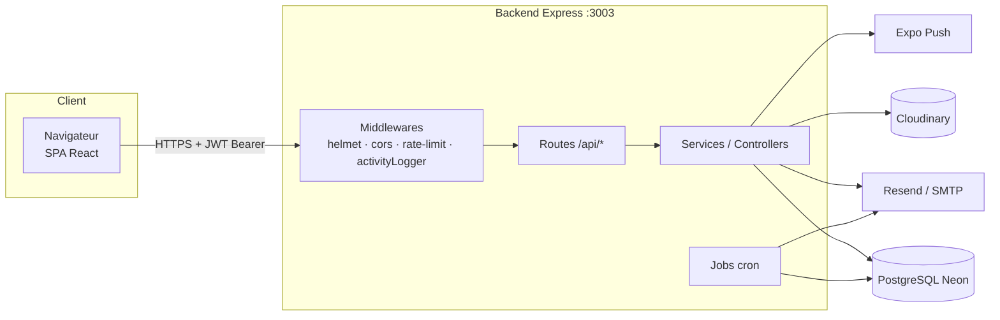

# Architecture — vue d'ensemble

## Stack

| Couche | Technologie (confirmée) |
|---|---|
| Frontend | React 18, Vite 5, Tailwind CSS 3, React Router 6, Axios, react-hook-form, i18next (FR/AR), FullCalendar, framer-motion, react-hot-toast, TanStack Query (présent dans les dépendances ; usage **à vérifier**) |
| Backend | Node.js ≥ 18, Express 4, `pg` (SQL brut, **pas d'ORM**), express-validator, Joi (dépendance), helmet, cors, compression, morgan, express-rate-limit, multer, node-cron, node-cache |
| Base de données | PostgreSQL (hébergée sur **Neon** d'après le code) |
| Authentification | JWT (jsonwebtoken) + bcryptjs |
| Fichiers | **Cloudinary** (principal) + disque local `backend/uploads` (secondaire) |
| E-mails | **Resend** (prioritaire) sinon **SMTP** via nodemailer |
| Push | Expo Push API (côté serveur uniquement) |
| Tests | Jest/supertest (backend), Vitest (frontend) — couverture très faible |

## Schéma global

## Communication frontend ⇄ backend

- Client Axios unique : `frontend/src/services/api.js` (baseURL depuis `frontend/src/config/api.js`).
- Le jeton JWT est lu dans `localStorage('token')` et envoyé dans `Authorization: Bearer …`.
- Intercepteurs : 401 → suppression du jeton + redirection `/` ; 403 → boîte de dialogue « accès restreint » ; 429/5xx/réseau → messages d'erreur.
- URL de l'API : `VITE_API_URL`, sinon `http://localhost:3003` en dev, sinon `https://creche-backend-mima.fly.dev`.
- Pas de WebSocket ni SSE identifié : les notifications et la messagerie fonctionnent par **requêtes (polling côté client — fréquence à vérifier)**.

## Modules backend (≈ 45 routeurs)

Le fichier `backend/server.js` monte tous les routeurs de `backend/routes_postgres/` sous `/api/...` (liste complète dans [endpoints](../07-api/endpoints.md)). La logique est répartie entre : routes (souvent avec SQL directement dans le handler), `services/` (17 fichiers), `controllers/` (14 fichiers dont une partie **non branchée**), `jobs/`, `emails/`.

## Modules frontend

`frontend/src/` : `pages/` (public, auth, parent, dashboard, staff, tasks, messages, activities…), `components/` (ui, layout, modals, mobile, widgets, activities…), `contexts/` (Auth, Settings, Language, Dialog), `access/` (système de permissions UI), `services/`, `hooks/`, `routes/AppRoutes.jsx`.

Voir [architecture technique détaillée](../06-technical/architecture.md).
