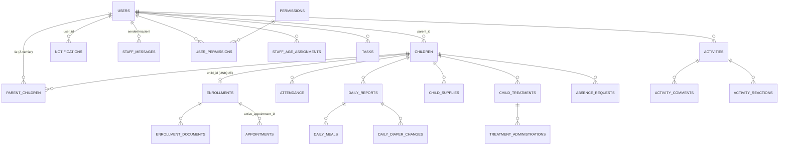

# Vue d'ensemble des entités

> Le schéma n'est pas centralisé (voir [database](../06-technical/database.md)). Les attributs listés proviennent du code (`init_database.js`, requêtes SQL, contrôleurs). Toute colonne non vue dans le code : **À vérifier dans le projet**.

| Entité | Table(s) | Fiche | Source du schéma |
|---|---|---|---|
| Utilisateur | `users`, `permissions`, `user_permissions` | [user](user.md) | `init_database.js`, `permissionsService.js` |
| Enfant | `children`, `parent_children`, `children_documents` | [child](child.md) | `init_database.js` (+ DB audit) |
| Inscription | `enrollments`, `enrollment_documents`, `enrollments_archive` | [enrollment](enrollment.md) | `init_database.js` + code |
| Rendez-vous | `appointments` | [appointment](appointment.md) | Audit DB seulement |
| Présence | `attendance`, `absence_requests` | [attendance](attendance.md) | `init_database.js` |
| Rapport journalier | `daily_reports`, `daily_meals`, `daily_diaper_changes` | [daily-report](daily-report.md) | `init_database.js` |
| Traitement | `child_treatments`, `treatment_administrations` | [treatment](treatment.md) | `treatmentsController.js` |
| Fournitures | `child_supplies`, `daily_supplies_brought` | [supply](supply.md) | `init_database.js` |
| Événement / tâche / mémo | `events`, `tasks`, `personal_memos`, … | [event-and-task](event-and-task.md) | Audit DB |
| Message | `staff_messages`, `contact_messages` | [message](message.md) | Audit DB |
| Notification | `notifications`, `email_logs` | [notification](notification.md) | `init_database.js` |
| Document | `admin_documents`, … | [document](document.md) | `db_postgres.js` |
| Activité / annonce / témoignage | `activities*`, `announcements`, `testimonials` | [activity-and-announcement](activity-and-announcement.md) | Audit DB, `db_postgres.js` |
| Paramètres / jours fériés | `nursery_settings`, `holidays`, `holiday_policies` | [settings-and-holidays](settings-and-holidays.md) | `init_database.js` |
