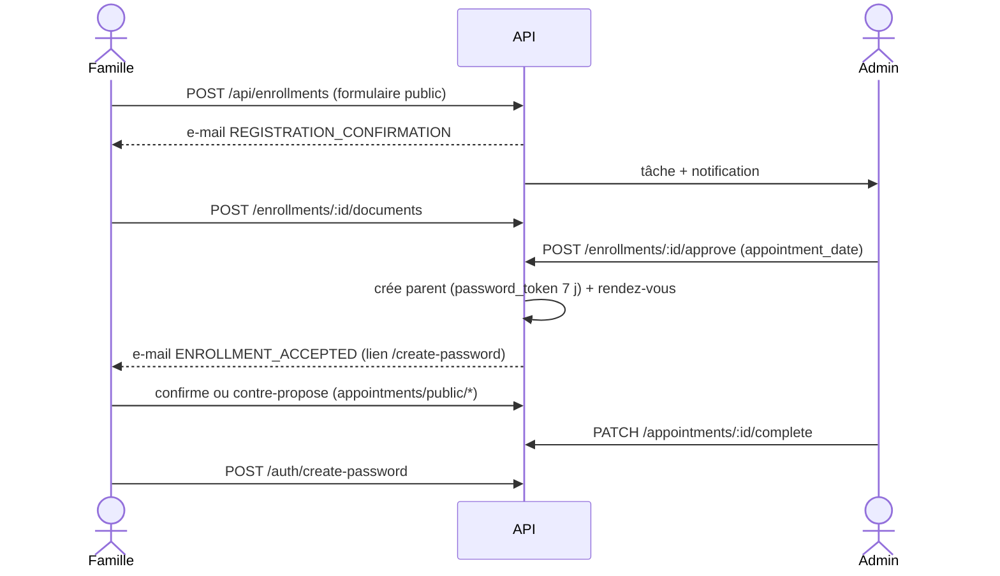
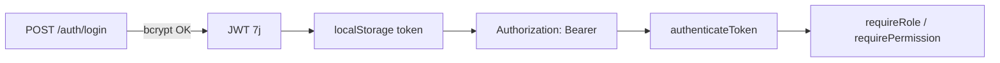
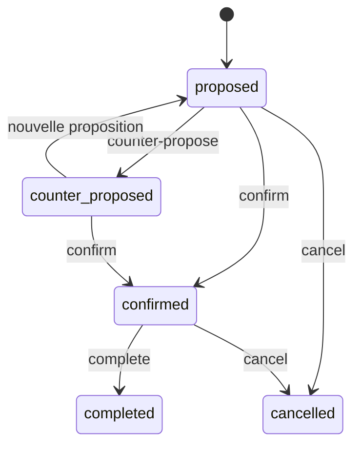

# Workflows

## 1. Inscription → approbation → rendez-vous → compte parent

Rejet : `PUT /:id/reject` → `rejected_incomplete` (e-mail documents manquants) ou `rejected_deleted` (e-mail de refus).

## 2. Authentification

## 3. Réinitialisation du mot de passe
`POST /auth/forgot-password` (réponse identique que le compte existe ou non) → e-mail avec jeton 1 h → `GET /auth/verify-reset-token/:token` → `POST /auth/reset-password`.

## 4. Négociation de rendez-vous

(`rescheduled`, `no_show`, `failed` existent dans le code sans transitions routées confirmées.)

## 5. Traitement médical
Création → apparition dans « aujourd'hui » → `POST /:id/administer` (trace) → cron (2 h) notifie les doses → annulation `DELETE /:id`.

## 6. Messagerie
Expéditeur → `POST /api/staff-messages` (contrôle `messages.parents` si staff→parent) → notification + push → destinataire lit (`PATCH /:id/read`).

## 7. Rapport journalier
brouillon → terminé → envoyé ; le parent lit via `/parent/my-children`.

## 8. Création de compte par l'admin
`POST /user-workflow/create-parent|create-staff` → e-mail avec jeton 7 j → `POST /user-workflow/set-password` ; `resend-password-link` si expiré.
