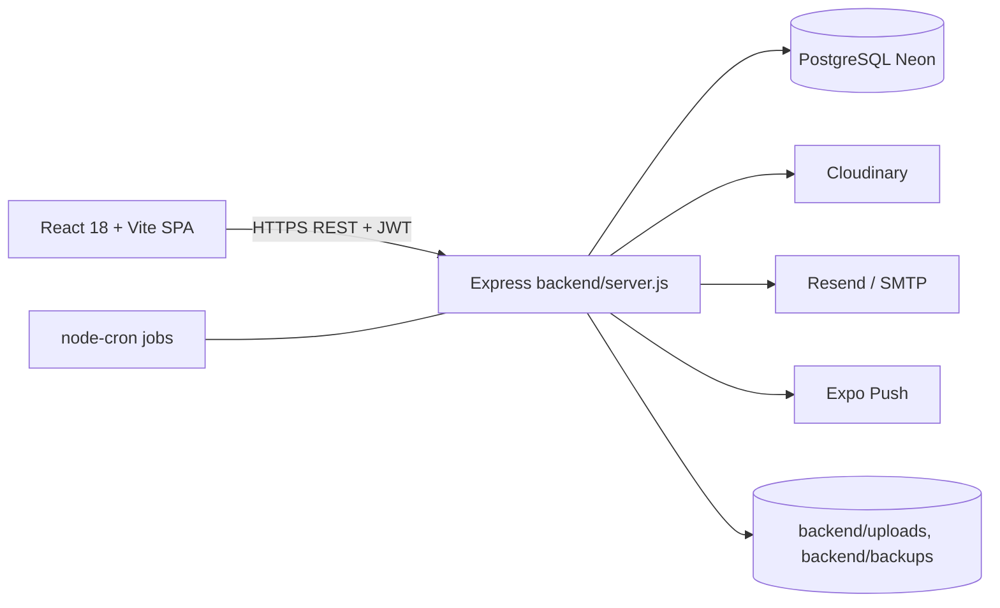

# Architecture technique

## Backend
- Entrée : `backend/server.js` (v2.1.0) ; le `server.js` racine est vide ; `backend/server_postgres.js` existe (statut **À vérifier**).
- Couches : `routes_postgres/` → (`controllers/`) → `services/` → `config/db_postgres.js` (SQL brut via `pg`, pool max 5, retry).
- Middlewares : helmet, cors (liste blanche), compression, morgan, rate-limit (1000 req/15 min en prod), `activityLogger`.
- Statique : `/uploads` et `/public` **sans authentification**.

## Frontend
React Router 6, Axios, i18next (FR/AR + RTL), Tailwind, FullCalendar, react-hot-toast. `AuthContext`, `ProtectedRoute`, `src/access/` (FEATURES, `useAccess`, `Can`).

## Modules backend (≈ 45 routeurs)
auth, users, user-workflow, children, enrollments, appointments, attendance, absence-requests, daily-reports, supplies, treatments, staff-assignments, staff-permissions, staff-messages, personal-memos, notifications, events, tasks, announcements, activities, activity-feed, activity-logs, logs, holidays, nursery-settings, schedule-settings, documents, cloudinary(+explorer), contacts, contact-messages, testimonials, virtual-tour, payment-alerts, dashboard, health, setup, debug, backup, recovery, profile, user (userChildren).

## Code inutilisé
`uploadController`, `userController`, `settingsController`, `tasksController`, `reportsController`, `attendanceController`, `logsController`, `documentsController`, `cacheMiddleware`, `routes/optimized-settings.js` (non monté).
