# Cartographie des écrans et navigation (Frontend)

Ce document répertorie l'ensemble des routes et composants d'interface utilisateur définis dans `frontend/src/routes/AppRoutes.jsx` et `frontend/src/components/dashboard/DashboardSidebar.jsx`.

---

## 1. Schéma général de navigation

```mermaid
flowchart TD
    Public[Zone Publique / Visiteur] --> Login["/login (Connexion)"]
    Public --> Inscription["/inscription (Demande d'inscription)"]
    Public --> Contact["/contact"]
    Public --> Visite["/visite-virtuelle"]
    Public --> Activites["/activites"]

    Login -->|Rôle parent| ParentSpace["/mon-espace (Espace Parent)"]
    Login -->|Rôle staff, admin, developer| Dashboard["/dashboard (Tableau de Bord)"]

    subgraph "Espace Parent (/mon-espace)"
        ParentSpace --> P_Enfants["child/:id (Fiche, Médical, Urgences)"]
        ParentSpace --> P_Rapports["daily-reports (Rapports journaliers)"]
        ParentSpace --> P_Traitements["treatments (Traitements médicaux)"]
        ParentSpace --> P_Presences["attendance-report (Historique)"]
        ParentSpace --> P_Absence["absence-request (Demande d'absence)"]
        ParentSpace --> P_Messages["messages (Messagerie)"]
        ParentSpace --> P_Activites["activities (Fil d'activités)"]
        ParentSpace --> P_Calendrier["calendar (Calendrier)"]
        ParentSpace --> P_AddChild["ajouter-enfant (Ajout enfant)"]
    end

    subgraph "Dashboard (/dashboard)"
        Dashboard --> D_Presences["attendance (Pointage & Historique)"]
        Dashboard --> D_Rapports["daily-reports (Saisie & Clôture)"]
        Dashboard --> D_Traitements["treatments (Administration médicaments)"]
        Dashboard --> D_Enfants["children (Liste & Fiches)"]
        Dashboard --> D_Planning["planning (Mensuel & Hebdo)"]
        Dashboard --> D_Activites["activities (Publications)"]
        Dashboard --> D_Messages["messages & mailbox"]
        
        Dashboard -->|Admin seul| D_Inscriptions["enrollments (Dossiers en attente & Décision)"]
        Dashboard -->|Admin seul| D_Users["parents, staff, add-user"]
        Dashboard -->|Admin seul| D_Stats["general-stats, attendance-report"]
        Dashboard -->|Admin & Developer| D_Settings["settings (Paramètres crèche)"]
        Dashboard -->|Developer seul| D_Dev["activity-logs, storage"]
    end
```

---

## 2. Inventaire exhaustif des routes

### A. Routes publiques (accessibles sans connexion)
| Route | Composant | Description |
|---|---|---|
| `/` | `HomePage` | Page d'accueil de la crèche |
| `/inscription` | `EnrollmentPage` | Formulaire public d'inscription pour les familles |
| `/contact` | `ContactPage` | Formulaire de contact public |
| `/visite-virtuelle` | `VirtualTourPage` | Galerie et découverte virtuelle |
| `/activites` | `ActivitiesPage` | Aperçu public des activités |
| `/register` | `RegisterPage` | Inscription directe de compte (**Attention faille de sécurité**) |
| `/forgot-password` | `ForgotPasswordPage` | Demande de réinitialisation de mot de passe |
| `/reset-password/:token` | `ResetPasswordPage` | Définition d'un nouveau mot de passe suite à demande |
| `/create-password` | `CreatePasswordPage` | Première définition de mot de passe (suite acceptation dossier) |
| `/upload-documents` | `UploadDocumentsPage` | Dépôt complémentaire de pièces pour un dossier d'inscription |
| `/recovery` | `RecoveryPage` | Interface d'urgence système |
| `/403`, `/500`, `*` | Pages d'erreur | Écrans d'erreur et redirection 404 |

### B. Espace Parent (`/mon-espace/*`)
Accessible aux utilisateurs ayant le rôle `parent` :
- `/mon-espace` : Tableau de bord parent synthétique
- `/mon-espace/messages` : Messagerie avec la crèche
- `/mon-espace/announcements` : Annonces officielles de la crèche
- `/mon-espace/calendar` : Calendrier des événements et jours de fermeture
- `/mon-espace/attendance-report` : Bilan des présences de ses enfants
- `/mon-espace/absence-request` : Formulaire de déclaration d'absence anticipée
- `/mon-espace/activities` : Fil de vie de la crèche (photos, commentaires, réactions)
- `/mon-espace/ajouter-enfant` : Inscription d'un enfant supplémentaire par un parent déjà enregistré
- `/mon-espace/child/:id` : Fiche détaillée de l'enfant
- `/mon-espace/child/:id/medical` : Fiche médicale de l'enfant (allergies, médecin, etc.)
- `/mon-espace/child/:id/emergency-contacts` : Contacts d'urgence de l'enfant
- `/mon-espace/daily-reports` : Consultation des comptes-rendus de journée (repas, siestes, soins)
- `/mon-espace/treatments` : Suivi des traitements médicamenteux prescrits

### C. Tableau de bord interne (`/dashboard/*`)
Accessible aux rôles `staff`, `admin` et `developer` (avec sous-filtrage selon rôle) :

| Catégorie | Sous-routes | Rôles autorisés (Menu) |
|---|---|---|
| **Enfants** | `/dashboard/children`, `/dashboard/children/absences` | `staff`, `admin`, `developer` |
| | `/dashboard/add-child` | `admin`, `developer` |
| **Inscriptions** | `/dashboard/enrollments`, `/dashboard/pending-enrollments`, `/dashboard/enrollments/documents` | `admin`, `developer` |
| **Présences** | `/dashboard/attendance/today`, `/dashboard/attendance/history`, `/dashboard/attendance/stats` | `staff`, `admin`, `developer` |
| **Rapports journaliers** | `/dashboard/daily-reports` | `staff`, `admin`, `developer` |
| **Traitements** | `/dashboard/treatments` | `staff`, `admin`, `developer` |
| **Planning & Tâches** | `/dashboard/planning/calendar`, `/dashboard/planning/weekly`, `/dashboard/tasks` | `staff`, `admin`, `developer` |
| **Messagerie & Courrier** | `/dashboard/messages`, `/dashboard/staff/send-message`, `/dashboard/mailbox` | `staff`, `admin`, `developer` |
| **Activités** | `/dashboard/activities`, `/dashboard/announcements` | `staff`, `admin`, `developer` |
| **Utilisateurs** | `/dashboard/parents`, `/dashboard/staff`, `/dashboard/add-user`, `/dashboard/staff-settings` | `admin`, `developer` |
| **Rapports & Stats** | `/dashboard/general-stats`, `/dashboard/attendance-report`, `/dashboard/activity-feed` | `admin`, `developer` |
| **Paramètres** | `/dashboard/settings` | `admin`, `developer` |
| **Outils Développeur** | `/dashboard/activity-logs`, `/dashboard/storage` | `developer` |
| **Témoignages** | `/dashboard/testimonials` | `admin`, `developer` |
